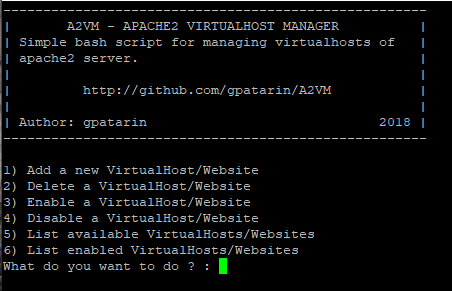

# A2VM
 Apache2 Virtual Host Manager is a bash script to manage Apache2 VirtualHosts simply via command line gui.
 
 
 
 #####  [Python version (Work in progress)](http://github.com/gpatarin/pyA2VM)
 
 Gael Patarin - 2018
